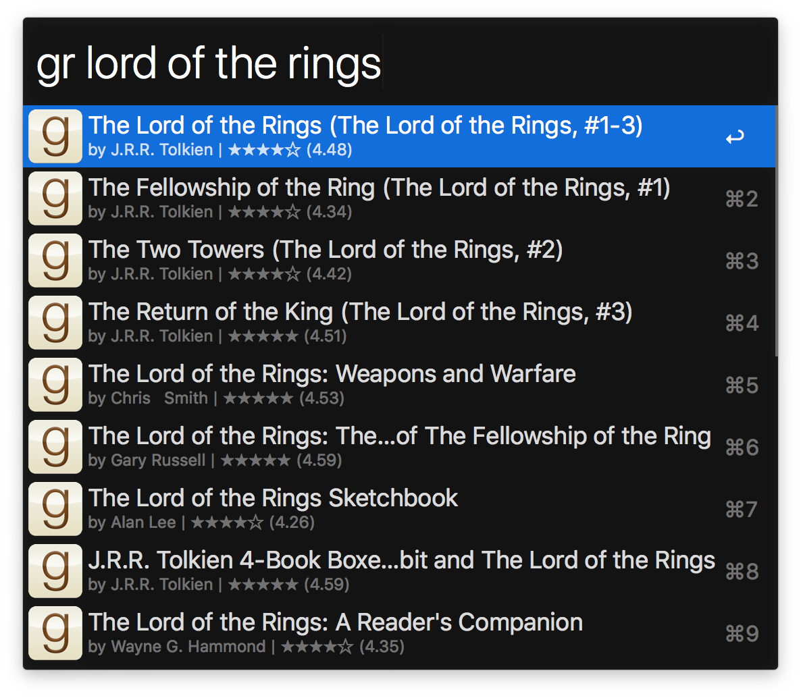

# Alfred Goodreads Workflow

Search Goodreads from the comfort of Alfred and get a quick status of the
projects.



## Install

```shell
$ npm install --global alfred-goodreads-workflow
```

*Requires [Node.js](https://nodejs.org) 4+ and the Alfred [Powerpack](https://www.alfredapp.com/powerpack/).*

## Usage

In Alfred, type `gr` then your query to search for Goodreads books. Hit
<kbd>Enter</kbd> to go to the book's Goodreads page.

## License

MIT © [Wes Baker](http://wesbaker.com)
